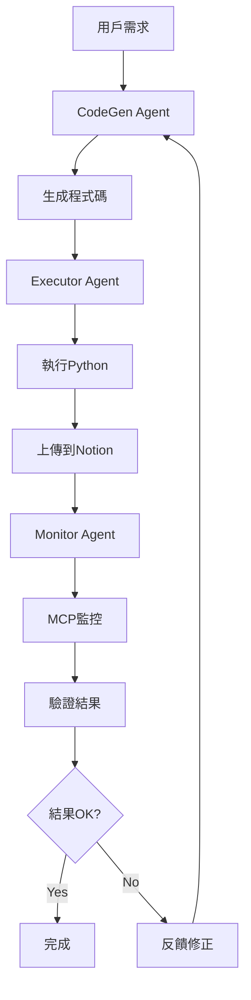

# 🤖 Claude Code 自動工作流設計

## 🎯 系統概覽

設計一個三Agent協作的自動化工作流：
- **CodeGen Agent**: 程式碼生成和需求分析
- **Executor Agent**: Python執行和Notion上傳
- **Monitor Agent**: MCP監管和結果驗證

## 🏗️ 整體架構



## 🎭 Agent 詳細設計

### 1. CodeGen Agent (程式碼生成器)

#### 核心職責
- 分析用戶需求和上下文
- 生成高質量的Python程式碼
- 處理錯誤反饋和程式碼修正
- 維護程式碼版本和迭代

#### 能力特徵
```python
class CodeGenAgent:
    def __init__(self):
        self.context_memory = {}
        self.code_templates = {}
        self.error_patterns = {}
    
    def analyze_requirements(self, user_input):
        """分析用戶需求，提取關鍵信息"""
        pass
    
    def generate_code(self, requirements):
        """基於需求生成Python程式碼"""
        pass
    
    def refine_code(self, feedback):
        """基於執行反饋改進程式碼"""
        pass
    
    def validate_code_quality(self, code):
        """程式碼質量檢查"""
        pass
```

#### 專業領域
- **Kobo數據處理**: SQLite查詢、章節提取、高亮分析
- **Notion API集成**: 頁面創建、內容格式化、批次上傳
- **錯誤處理模式**: 重試機制、異常捕獲、數據驗證
- **性能優化**: 並發處理、記憶體管理、API限流

### 2. Executor Agent (執行引擎)

#### 核心職責
- 安全執行Python程式碼
- 管理執行環境和依賴
- 處理Notion API交互
- 收集執行日誌和性能數據

#### 能力特徵  
```python
class ExecutorAgent:
    def __init__(self):
        self.sandbox_env = SandboxEnvironment()
        self.notion_client = NotionClient()
        self.execution_history = []
    
    def execute_code(self, code, context):
        """在沙盒環境中執行程式碼"""
        pass
    
    def upload_to_notion(self, data, page_config):
        """處理Notion上傳邏輯"""
        pass
    
    def collect_metrics(self, execution_result):
        """收集執行指標和日誌"""
        pass
    
    def handle_errors(self, error):
        """錯誤處理和恢復機制"""
        pass
```

#### 執行環境
- **沙盒隔離**: 安全執行用戶生成的程式碼
- **依賴管理**: 自動安裝和管理Python包
- **資源限制**: CPU、記憶體、執行時間限制
- **日誌收集**: 詳細的執行日誌和性能指標

### 3. Monitor Agent (監控守護者)

#### 核心職責
- 透過MCP監控Notion頁面狀態
- 驗證上傳結果的正確性
- 檢測數據完整性和格式問題
- 提供改進建議和問題報告

#### 能力特徵
```python
class MonitorAgent:
    def __init__(self):
        self.mcp_client = MCPClient()
        self.validation_rules = {}
        self.quality_metrics = {}
    
    def monitor_notion_page(self, page_id):
        """透過MCP監控Notion頁面"""
        pass
    
    def validate_upload_result(self, expected, actual):
        """驗證上傳結果的正確性"""
        pass
    
    def check_data_integrity(self, page_data):
        """檢查數據完整性"""
        pass
    
    def generate_feedback(self, validation_result):
        """生成改進反饋"""
        pass
```

#### MCP整合
- **頁面內容讀取**: 獲取Notion頁面的實際內容
- **結構分析**: 驗證章節順序、標題格式、內容完整性
- **品質評估**: 檢查排版、格式、數據準確性
- **異常檢測**: 識別上傳失敗、格式錯誤、數據遺失

## 🔄 工作流程設計

### Phase 1: 需求分析和程式碼生成
```python
# CodeGen Agent 流程
def workflow_phase1(user_request):
    # 1. 分析需求
    requirements = analyze_user_request(user_request)
    
    # 2. 檢查上下文
    context = load_context_memory()
    
    # 3. 生成程式碼
    code = generate_optimized_code(requirements, context)
    
    # 4. 程式碼驗證
    validation_result = validate_code_safety(code)
    
    return {
        'code': code,
        'requirements': requirements,
        'validation': validation_result
    }
```

### Phase 2: 程式碼執行和上傳
```python
# Executor Agent 流程  
def workflow_phase2(code_package):
    # 1. 準備執行環境
    env = setup_sandbox_environment()
    
    # 2. 執行程式碼
    execution_result = execute_in_sandbox(code_package['code'], env)
    
    # 3. 處理結果
    if execution_result.success:
        notion_result = upload_to_notion(execution_result.data)
        return {
            'status': 'success',
            'notion_page_id': notion_result.page_id,
            'execution_log': execution_result.log
        }
    else:
        return {
            'status': 'error', 
            'error': execution_result.error,
            'traceback': execution_result.traceback
        }
```

### Phase 3: 結果監控和驗證
```python
# Monitor Agent 流程
def workflow_phase3(execution_result):
    if execution_result['status'] == 'success':
        page_id = execution_result['notion_page_id']
        
        # 1. 透過MCP監控頁面
        page_content = mcp_client.get_notion_page(page_id)
        
        # 2. 驗證內容質量
        validation = validate_page_content(page_content)
        
        # 3. 生成品質報告
        quality_report = generate_quality_report(validation)
        
        # 4. 決定是否需要修正
        if validation.score < QUALITY_THRESHOLD:
            feedback = generate_improvement_feedback(validation)
            return {
                'status': 'needs_improvement',
                'feedback': feedback,
                'quality_score': validation.score
            }
        else:
            return {
                'status': 'completed',
                'quality_score': validation.score,
                'report': quality_report
            }
    else:
        # 處理執行錯誤
        error_analysis = analyze_execution_error(execution_result['error'])
        feedback = generate_error_feedback(error_analysis)
        return {
            'status': 'execution_failed',
            'feedback': feedback
        }
```

## 🛠️ 技術實現方案

### 1. Agent通信機制

#### Message Queue系統
```python
# 基於Redis的訊息佇列
class AgentMessageQueue:
    def __init__(self):
        self.redis_client = redis.Redis()
        self.queues = {
            'codegen_to_executor': 'queue:codegen_executor',
            'executor_to_monitor': 'queue:executor_monitor', 
            'monitor_to_codegen': 'queue:monitor_codegen'
        }
    
    def send_message(self, from_agent, to_agent, message):
        queue_key = f"{from_agent}_to_{to_agent}"
        self.redis_client.lpush(self.queues[queue_key], json.dumps(message))
    
    def receive_message(self, agent_name, timeout=30):
        for queue_name, queue_key in self.queues.items():
            if queue_name.endswith(f"_to_{agent_name}"):
                message = self.redis_client.brpop(queue_key, timeout=timeout)
                if message:
                    return json.loads(message[1])
        return None
```

#### Agent協調器
```python
class WorkflowCoordinator:
    def __init__(self):
        self.message_queue = AgentMessageQueue()
        self.agents = {
            'codegen': CodeGenAgent(),
            'executor': ExecutorAgent(), 
            'monitor': MonitorAgent()
        }
        self.workflow_state = {}
    
    def execute_workflow(self, user_request, workflow_id):
        # 啟動工作流
        self.workflow_state[workflow_id] = {
            'status': 'running',
            'current_phase': 1,
            'start_time': datetime.now(),
            'request': user_request
        }
        
        # Phase 1: CodeGen
        code_result = self.agents['codegen'].process_request(user_request)
        self.message_queue.send_message('codegen', 'executor', code_result)
        
        # Phase 2: Executor
        execution_result = self.agents['executor'].wait_and_process()
        self.message_queue.send_message('executor', 'monitor', execution_result)
        
        # Phase 3: Monitor
        monitor_result = self.agents['monitor'].wait_and_process()
        
        # 處理反饋循環
        if monitor_result['status'] == 'needs_improvement':
            self.message_queue.send_message('monitor', 'codegen', monitor_result['feedback'])
            return self.execute_workflow(user_request, workflow_id)  # 遞迴重試
        
        return monitor_result
```

### 2. MCP集成設計

#### MCP Notion監控器
```python
class MCPNotionMonitor:
    def __init__(self, mcp_server_config):
        self.mcp_client = MCPClient(mcp_server_config)
        self.validation_rules = self.load_validation_rules()
    
    def monitor_page_upload(self, page_id, expected_structure):
        """監控頁面上傳結果"""
        try:
            # 透過MCP獲取頁面內容
            page_data = self.mcp_client.call_tool(
                'notion_get_page',
                {'page_id': page_id, 'include_content': True}
            )
            
            # 驗證頁面結構
            structure_validation = self.validate_page_structure(
                page_data, expected_structure
            )
            
            # 檢查內容完整性
            content_validation = self.validate_content_integrity(page_data)
            
            # 評估格式質量
            format_validation = self.validate_formatting_quality(page_data)
            
            return {
                'page_id': page_id,
                'structure_score': structure_validation.score,
                'content_score': content_validation.score,
                'format_score': format_validation.score,
                'overall_score': self.calculate_overall_score([
                    structure_validation, content_validation, format_validation
                ]),
                'issues': self.collect_all_issues([
                    structure_validation, content_validation, format_validation
                ]),
                'suggestions': self.generate_improvement_suggestions(page_data)
            }
            
        except Exception as e:
            return {
                'error': f"MCP監控失敗: {str(e)}",
                'page_id': page_id,
                'status': 'monitor_failed'
            }
    
    def validate_page_structure(self, page_data, expected):
        """驗證頁面結構是否符合預期"""
        issues = []
        score = 100.0
        
        # 檢查標題層次
        if not self.check_heading_hierarchy(page_data):
            issues.append("標題層次不正確")
            score -= 20
            
        # 檢查章節順序  
        if not self.check_chapter_order(page_data):
            issues.append("章節順序錯亂")
            score -= 30
            
        # 檢查必要元素
        required_elements = ['highlights_heading', 'chapter_sections']
        for element in required_elements:
            if not self.has_element(page_data, element):
                issues.append(f"缺少必要元素: {element}")
                score -= 15
        
        return ValidationResult(score=max(0, score), issues=issues)
    
    def validate_content_integrity(self, page_data):
        """驗證內容完整性"""
        issues = []
        score = 100.0
        
        # 檢查空白內容
        empty_blocks = self.count_empty_blocks(page_data)
        if empty_blocks > 0:
            issues.append(f"發現 {empty_blocks} 個空白區塊")
            score -= empty_blocks * 5
        
        # 檢查重複內容
        duplicates = self.detect_duplicate_content(page_data)
        if duplicates:
            issues.append(f"發現重複內容: {len(duplicates)} 處")
            score -= len(duplicates) * 10
            
        # 檢查截斷內容
        truncated = self.detect_truncated_content(page_data)
        if truncated:
            issues.append("發現內容截斷問題")
            score -= 25
            
        return ValidationResult(score=max(0, score), issues=issues)
```

### 3. 沙盒執行環境

#### Docker容器隔離
```python
class SandboxEnvironment:
    def __init__(self):
        self.docker_client = docker.from_env()
        self.container_config = {
            'image': 'python:3.11-alpine',
            'mem_limit': '512m',
            'cpu_quota': 50000,  # 50% CPU
            'network_mode': 'none',  # 無網路存取
            'volumes': {
                '/tmp/sandbox': {'bind': '/workspace', 'mode': 'rw'}
            }
        }
    
    def execute_code(self, code, timeout=300):
        """在隔離容器中執行程式碼"""
        try:
            # 準備程式碼文件
            code_file = self.prepare_code_file(code)
            
            # 啟動容器
            container = self.docker_client.containers.run(
                **self.container_config,
                command=f"python /workspace/{code_file}",
                detach=True
            )
            
            # 等待執行完成
            result = container.wait(timeout=timeout)
            logs = container.logs().decode('utf-8')
            
            # 清理容器
            container.remove()
            
            return ExecutionResult(
                success=result['StatusCode'] == 0,
                output=logs,
                exit_code=result['StatusCode']
            )
            
        except Exception as e:
            return ExecutionResult(
                success=False,
                error=str(e),
                output=""
            )
```

## 🎛️ 配置和部署

### 1. 環境配置
```yaml
# config/workflow_config.yaml
agents:
  codegen:
    model: "claude-3-sonnet"
    temperature: 0.1
    max_tokens: 4000
    
  executor:
    sandbox:
      timeout: 300
      memory_limit: "512MB" 
      cpu_limit: 0.5
    notion:
      rate_limit: 100  # requests per minute
      batch_size: 80
      
  monitor:
    mcp:
      server_url: "http://localhost:3000"
      timeout: 30
    validation:
      quality_threshold: 80
      retry_attempts: 3

workflow:
  max_iterations: 5
  timeout: 1800  # 30 minutes
  
logging:
  level: "INFO"
  file: "logs/workflow.log"
  max_size: "100MB"
```

### 2. 部署架構
```docker
# docker-compose.yml
version: '3.8'
services:
  workflow-coordinator:
    build: .
    environment:
      - CLAUDE_API_KEY=${CLAUDE_API_KEY}
      - NOTION_TOKEN=${NOTION_TOKEN}
    volumes:
      - ./logs:/app/logs
      - /var/run/docker.sock:/var/run/docker.sock
    
  redis-queue:
    image: redis:alpine
    ports:
      - "6379:6379"
    
  mcp-server:
    build: ./mcp
    ports:
      - "3000:3000"
    environment:
      - NOTION_TOKEN=${NOTION_TOKEN}
```

## 🚀 使用示例

### 基本工作流程
```python
# 啟動工作流
coordinator = WorkflowCoordinator()

user_request = """
我需要同步我的Kobo閱讀筆記到Notion。
要求：
1. 按章節正確排序
2. 清理重複的高亮
3. 格式化為美觀的頁面
4. 添加閱讀統計信息
"""

result = coordinator.execute_workflow(user_request, workflow_id="sync_001")

# 監控結果
if result['status'] == 'completed':
    print(f"✅ 工作流完成，品質分數: {result['quality_score']}")
    print(f"📊 報告: {result['report']}")
elif result['status'] == 'needs_improvement':
    print(f"⚠️ 需要改進，分數: {result['quality_score']}")
    print(f"💡 建議: {result['feedback']}")
else:
    print(f"❌ 執行失敗: {result.get('error', '未知錯誤')}")
```

### 高級定制化
```python
# 自定義Agent行為
codegen_config = {
    'specialization': 'kobo_notion_sync',
    'code_style': 'clean_architecture',
    'error_handling': 'comprehensive',
    'performance_focus': True
}

executor_config = {
    'sandbox_security': 'high',
    'notion_optimization': True,
    'parallel_processing': True,
    'retry_strategy': 'exponential_backoff'
}

monitor_config = {
    'validation_depth': 'thorough',
    'quality_metrics': ['structure', 'content', 'format', 'performance'],
    'auto_correction': True,
    'feedback_detail': 'comprehensive'
}

# 啟動定制化工作流
custom_coordinator = WorkflowCoordinator(
    codegen_config, executor_config, monitor_config
)
```

## 📈 監控和分析

### 工作流指標
- **成功率**: 完整工作流完成率
- **品質分數**: MCP驗證的平均品質
- **執行時間**: 各階段的性能指標
- **錯誤模式**: 常見錯誤和解決方案

### 持續改進
- **Code Template優化**: 基於成功案例更新模板
- **錯誤Pattern學習**: 累積錯誤處理經驗
- **品質Standard調整**: 根據用戶反饋調整標準
- **Performance調優**: 基於指標持續優化

這個設計提供了一個完整的、可擴展的Claude Code自動工作流系統，能夠處理複雜的多步驟任務並確保高品質的結果。